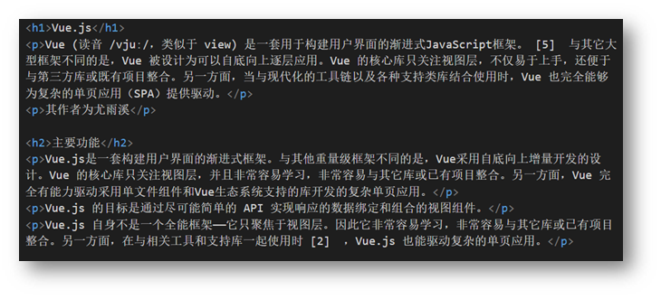

<h2 id="mvpFg">标签语法</h2>
HTML 超文本标记语言——HyperText Markup Language。

- 超文本：链接
- 标记：标签，带尖括号的文本



<h3 id="kX8WB">标签结构</h3>
+ 标签要**成对出现**，中间包裹内容
+ <> 里面放英文字母（标签名）
+ 结束标签比开始标签多
+ 标签分类：双标签和单标签

```html
<strong>需要加粗的文字</strong>
<br />
<hr />
```


<h2 id="NBCzH">HTML骨架</h2>
+ html：整个网页
+ head：网页头部，用来存放给浏览器看的信息，例如 CSS
    - title：网页标题
+ body：网页主体，用来存放给用户看的信息，例如图片、文字

```html
<html>
  <head>
    <title>网页标题</title>
  </head>

  <body>
    网页主体
  </body>
</html>
```

<h2 id="r7yqT">标签的关系</h2>
> 作用：明确标签的书写位置，让代码格式更整齐
>

- 父子关系（嵌套关系）：子级标签换行且缩进（Tab 键）
- 兄弟关系（并列关系）：兄弟标签换行要对齐

```html
<head></head>
<body>
  <div></div>
</body>
```

<h2 id="AYulJ">注释</h2>
概念：注释是对代码的解释和说明，能够提高程序的可读性，方便理解、查找代码。

注释不会再浏览器中显示。

```html
<!-- 我是 HTML 注释 -->
```

<h2 id="oLsaF">标题标签</h2>
一般用在**新闻标题、文章标题、网页区域名称、产品名称**等等。

```html
<h1>一级标题</h1>

<h2>二级标题</h2>

<h3>三级标题</h3>

<h4>四级标题</h4>

<h5>五级标题</h5>

<h6>六级标题</h6>
```

显示特点：

- 文字加粗
- 字号逐渐减小
- 独占一行（换行）

> 经验
>
> 1. **h1 标签在一个网页中只能用一次**，用来放新闻标题或网页的 logo，搜索引擎能够准确查找
> 2. h2 ~ h6 没有使用次数的限制

<h2 id="LJfoH">段落标签</h2>
一般用在新闻段落、文章段落、产品描述信息等等。

```html
<p>段落</p>
```

显示特点：

- 独占一行
- 段落之间存在间隙

<h2 id="lJjAm">换行和水平线</h2>
+ 换行：br
+ 水平线：hr

```html
<br />
<hr />
```

<h2 id="Mfhju">文本格式化标签</h2>
作用：为文本添加特殊格式，以突出重点。常见的文本格式：加粗、倾斜、下划线、删除线等。


> 提示：strong、em、ins、del 标签自带强调含义（语义）。

<h2 id="PuwMI">图像标签</h2>
作用：在网页中插入图片

```html

```

src 用于指定图像的位置和名称，是 的必须属性。

<h3 id="ndbnJ">图像属性</h3>


<h3 id="Mzoi4">属性语法</h3>
+ 属性名="属性值"
+ 属性写在尖括号里面，标签名后面，标签名和属性之间用空格隔开，不区分先后顺序


<h2 id="m9xFk">路径<font style="color:rgb(255, 255, 255);">⭐</font></h2>
概念：路径指的是查找文件时，从**起点**到**终点**经历的**路线**。

路径分类：

- 相对路径：从当前文件位置出发查找目标文件
- 绝对路径：从盘符出发查找目标文件
  - Windows 电脑从盘符出发
  - Mac 电脑从根目录出发

<h3 id="JMjoP">相对路径</h3>
查找方式：从当前文件位置出发查找目标文件

特殊符号：

- **/** 表示进入某个文件夹里面 → 文件夹名/
- **.** 表示当前文件所在文件夹 → ./
- **..** 表示当前文件的上一级文件夹 → ../


<h3 id="DXHpW">绝对路径</h3>
查找方式：Windows 电脑从盘符出发；Mac 电脑从根目录（/）出发

```html
  
```

> 提示
>
> 1. Windows 默认是 \ ，其他系统是 /，建议统一写为 /

<h2 id="aclb3">超链接标签</h2>
作用：点击跳转到其他页面。

```html
  <a href="https://www.baidu.com">跳转到百度</a>
```

**href 属性值是跳转地址，是超链接的必须属性。**

超链接默认是在当前窗口跳转页面，添加 **<font style="color:#DF2A3F;">target="\_blank"</font>** 实现**新窗口**打开页面。

拓展：开发初期，不确定跳转地址，则 href 属性值写为 **#**，表示**空链接**，页面不会跳转，在
**<font style="color:#DF2A3F;">当前页面刷新一次</font>**。

```html
<a href="https://www.baidu.com/">跳转到百度</a>

<!-- 跳转到本地文件：相对路径查找 -->
<!-- target="_blank" 新窗口跳转页面 -->
<a href="e4307999d1df4fa0590d646826939818" target="_blank"
  >跳转到01-标签的写法</a
>

<!-- 开发初期，不知道超链接的跳转地址，href属性值写#，表示空链接，不会跳转 -->
<a href="#">空链接</a>
```

<h2 id="Z6c0y">音频</h2>

```html
<audio src="音频的 URL"></audio>
```

常用属性


> 拓展：书写 HTML5 属性时，如果属性名和属性值相同，可以简写为一个单词。

```html
<!-- 在 HTML5 里面，如果属性名和属性值完全一样，可以简写为一个单词 -->
<audio src="./media/music.mp3" controls loop autoplay></audio>
```

<h2 id="KFfoL">视频</h2>

```html
<video src="视频的 URL"></video>
```

常用属性


```html
<!-- 在浏览器中，想要自动播放，必须有 muted 属性 -->
<video src="./media/vue.mp4" controls loop muted autoplay></video>
```
