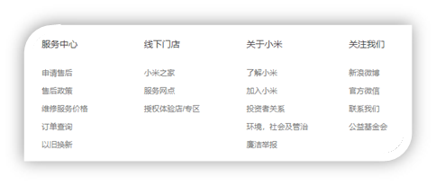
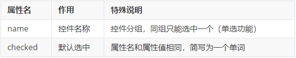
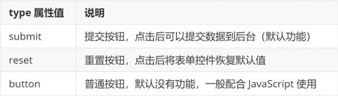

<h2 id="Mk7dp">列表</h2>
作用：布局内容排列整齐的区域。

列表分类：无序列表、有序列表、定义列表。

<h3 id="l90pC">无序列表</h3>
作用：布局排列整齐的**不需要规定顺序**的区域。

标签：ul 嵌套 li，ul 是无序列表，li 是列表条目。

```html
<ul>
  <li>第一项</li>

  <li>第二项</li>

  <li>第三项</li>

  ……
</ul>

```

> 注意事项：
>
> + ul 标签里面只能包裹 li 标签
> + li 标签里面可以包裹任何内容
>

<h3 id="c776t">有序列表</h3>

作用：布局排列整齐的**需要规定顺序**的区域。

标签：ol 嵌套 li，ol 是有序列表，li 是列表条目。

```html title="有序列表"
<ol>
  
  <li>第一项</li>
  <li>第二项</li>
  <li>第三项</li>
  
  ……
</ol>
```

> 注意事项：
>
> + `ol` 标签里面只能包裹`li` 标签
> + `li` 标签里面可以包裹任何内容
>

<h3 id="BiIGM">定义列表</h3>

标签：dl 嵌套 dt 和 dd，dl 是定义列表，dt 是定义列表的标题，dd 是定义列表的描述 / 详情。

```html
<dl>
  <dt>列表标题</dt>
  <dd>列表描述 / 详情</dd>
   ……
</dl>

```



> 注意事项：
>
> + dl 里面只能包含dt 和 dd
> + dt 和 dd 里面可以包含任何内容
>

<h2 id="dU8dD">表格</h2>
网页中的表格与 Excel 表格类似，用来展示数据。 


<h3 id="ZKvn9">基本使用</h3>


标签：table 嵌套 tr，tr 嵌套 td / th。 


> 提示：在网页中，**表格默认没有边框线**，使用 **border 属性**可以为表格添加边框线。 
>

```html
<table border="1">
  <tr>
    <th>姓名</th>
    <th>语文</th>
    <th>数学</th>
    <th>总分</th>
  </tr>

  <tr>
    <td>张三</td>
    <td>99</td>
    <td>100</td>
    <td>199</td>
  </tr>

  <tr>
    <td>李四</td>
    <td>98</td>
    <td>100</td>
    <td>198</td>
  </tr>

  <tr>
    <td>总结</td>
    <td>全市第一</td>
    <td>全市第一</td>
    <td>全市第一</td>
  </tr>

</table>

```

<h3 id="WIVgg">表格结构标签(了解)</h3>
作用：用表格结构标签把内容划分区域，让表格结构更清晰，语义更清晰。


> 提示：表格结构标签可以省略。
>

<h3 id="ENuG8">合并单元格</h3>
作用：将多个单元格合并成一个单元格，以合并同类信息。 


合并单元格的步骤：

1. 明确合并的目标
2. 保留**最左最上**的单元格，添加属性（取值是**数字**，表示需要**合并的单元格数量**）

    - **跨行合并**，保留最上单元格，添加属性 **`rowspan`**
  - 
    - **跨列合并**，保留最左单元格，添加属性 **`colspan`**
3. 删除其他单元格

```html
<table border="1">
  <thead>
    <tr>
      <th>姓名</th>
      <th>语文</th>
      <th>数学</th>
      <th>总分</th>
    </tr>
  </thead>
  <tbody>
    <tr>
      <td>张三</td>
      <td>99</td>
      <td rowspan="2">100</td>
      <td>199</td>
    </tr>
    <tr>
    <td>李四</td>
      <td>98</td>
      <!-- <td>100</td> -->
      <td>198</td>
    </tr>
  </tbody>
  <tfoot>
    <tr>
      <td>总结</td>
      <td colspan="3">全市第一</td>
      <!-- <td>全市第一</td>
      <td>全市第一</td> -->
    </tr>
  </tfoot>
</table>
```

> 注意：**不能跨表格结构标签合并单元格**（thead、tbody、tfoot）。
>

<h2 id="cbRi5">表单<font style="color:rgb(255, 255, 255);">⭐</font></h2>
作用：收集用户信息。

使用场景：

+ 登录页面
+ 注册页面
+ 搜索区域

<h3 id="JTV2o">input 标签</h3>
input 标签 type 属性值不同，则功能不同。 

```html
<input type="..." >
```


<h3 id="d2jIO">input 标签占位文本</h3>
占位文本：提示信息，文本框和密码框都可以使用。 

```html
<input type="..." placeholder="提示信息">
```

<h3 id="XFSmc">单选框</h3>

常用属性




```html
<input type="radio" name="gender" checked> 男
<input type="radio" name="gender"> 女
```

> 提示：name 属性值自定义。
>

<h3 id="ptaEy">上传文件</h3>

默认情况下，文件上传表单控件只能上传一个文件，添加 multiple 属性可以实现文件多选功能。


```html
<input type="file" multiple>
```

<h3 id="W6fPc">多选框</h3>
多选框也叫复选框，默认选中：checked。

```html
<input type="checkbox" checked>
```

<h3 id="fpokg">下拉菜单</h3>


标签：select 嵌套 option，select 是下拉菜单整体，option是下拉菜单的每一项。

```html
<select>
  <option>北京</option>
  <option>上海</option>
  <option>广州</option>
  <option>深圳</option>
  <option selected>武汉</option>

</select>

```

> 默认显示第一项，**<font style="color:#DF2A3F;">selected</font>**<font style="color:#DF2A3F;"> </font>属性实现**默认选中**功能。
>

<h3 id="jclWn">文本域</h3>
作用：多行输入文本的表单控件。 


```html
<textarea>默认提示文字</textarea>
```

> 注意点：
>
> + 实际开发中，使用 CSS 设置文本域的尺寸
> + 实际开发中，**一般禁用右下角的拖拽功能**
>

<h3 id="xRkhT">label 标签</h3>
**作用：**网页中，某个标签的说明文本。 


**经验：**用 label 标签绑定文字和表单控件的关系，增大表单控件的点击范围。 


+ 写法一
    - label 标签只包裹内容，不包裹表单控件
    - 设置 label 标签的 for 属性值 和表单控件的 id 属性值相同

```html
<input type="radio" id="man">
<label for="man">男</label>
```

+ 写法二：使用 label 标签包裹文字和表单控件，不需要属性

```html
<label><input type="radio"> 女</label>
```

> 提示：支持 label 标签增大点击范围的表单控件：**文本框、密码框、上传文件、单选框、多选框、下拉菜单、文本域**等等。 
>

<h3 id="abYyN">按钮</h3>

```html
<button type="">按钮</button>
```




```html
<!-- form 表单区域 -->
<!-- action="" 发送数据的地址 -->
<form action="">
  用户名：<input type="text">
  <br><br>
  密码：<input type="password">
  <br><br>

  <!-- 如果省略 type 属性，功能是 提交 -->
  <button type="submit">提交</button>
  <button type="reset">重置</button>
  <button type="button">普通按钮</button>

</form>

```

> 提示：按钮需配合 form 标签（表单区域）才能实现对应的功能。
>

<h2 id="hkpkR">语义化</h2>
<h3 id="LGwS1">无语义的布局标签</h3>
作用：布局网页（划分网页区域，摆放内容）

+ div：独占一行
+ span：不换行

```html
<div>div 标签，独占一行</div>
<span>span 标签，不换行</span>
```

<h3 id="kBZ7f">有语义的布局标签</h3>


<h2 id="wkL1L">字符实体</h2>


